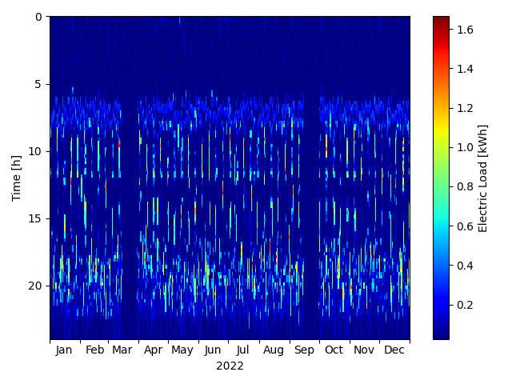

 
 

# pyLPG

This package provides bindings and binaries to execute the [LoadProfileGenerator](https://www.loadprofilegenerator.de/) (LPG) from python.

Basically it 
* converts your settings into a JSON file for the LPG that specifies what the LPG should calculate,
* starts the binary depending on your platform (Windows/Linux), 
* waits for the results,
* and then returns the results as pandas dataframe.

Look into the [single household example](examples/single_household.py) for a simple example on use.

Example of a generated electricity load profile as a carpet plot:

 

Note that this package downloads the full LPG binaries and the database on first use.

If you want to use a different database than the one that comes with the package, you need to replace the files.

## Installation

This package can be installed via pip:

    pip install pyloadprofilegenerator

## License

MIT License

Copyright (C) 2022 Noah Pflugradt (FZJ IEK-3), David Neuroth (FZJ IEK-3), Peter Stenzel (FZJ IEK-3), Leander Kotzur (FZJ IEK-3), Detlef Stolten (FZJ IEK-3)

You should have received a copy of the MIT License along with this program.
If not, see https://opensource.org/licenses/MIT

## Citing

If you use pylpg in a published work, please cite:

Noah Pflugradt, Peter Stenzel, Leander Kotzur, and Detlef Stolten (2022). LoadProfileGenerator: An Agent-Based Behavior Simulation for Generating Residential Load Profiles. Journal of Open Source Software, 7(71), 3574, https://doi.org/10.21105/joss.03574

## About Us

We are the <a href="https://www.fz-juelich.de/en/iek/iek-3">Institute of Energy and Climate Research - Techno-economic Systems Analysis (IEK-3)</a> belonging to the <a href="https://www.fz-juelich.de/en">Forschungszentrum Jülich</a>. Our interdisciplinary department's research is focusing on energy-related process and systems analyses. Data searches and system simulations are used to determine energy and mass balances, as well as to evaluate performance, emissions and costs of energy systems. The results are used for performing comparative assessment studies between the various systems. Our current priorities include the development of energy strategies, in accordance with the German Federal Government’s greenhouse gas reduction targets, by designing new infrastructures for sustainable and secure energy supply chains and by conducting cost analysis studies for integrating new technologies into future energy market frameworks.

## Contributing

We need your help to make pyLPG an even better tool than it is. Please raise an issue, if it is not clear how to use the package, if you find a bug, or if you have an idea how to improve. If you have implemented a solution, you are invited to contribute with a pull request.

