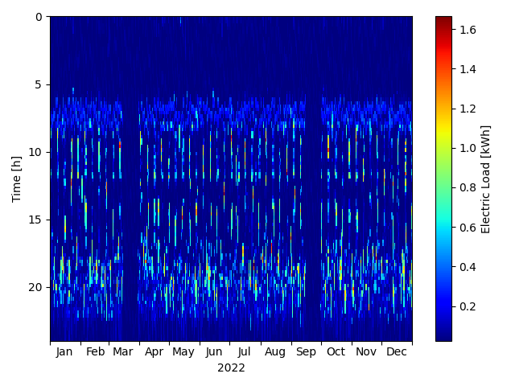

[](https://pypi.python.org/pypi/pyloadprofilegenerator)
[](LICENSE)

# pyLPG

This package provides bindings and binaries to execute the [LoadProfileGenerator](https://www.loadprofilegenerator.de/) (LPG) from python.

Basically it

- converts your settings into a JSON file for the LPG that specifies what the LPG should calculate,
- starts the binary depending on your platform (Windows/Linux),
- waits for the results,
- and then returns the results as pandas dataframe.

Look into the [single household example](examples/single_household.py) for a simple example on use.

Example of a generated electricity load profile as a carpet plot:

<a href=examples/example_carpet_plot.png></a>

Note that this package downloads the full LPG binaries and the database on first use.

If you want to use a different database than the one that comes with the package, you need to replace the files.

## Choosing The LPG Binary At Runtime

By default, pyLPG uses the LPG binary that ships with the package. On the first run, it checks whether the platform-specific binary is already available in the local package directory. If it is missing, pyLPG downloads the official LPG release for your operating system, stores it locally, and then executes that bundled binary for the calculation.

In some setups, you may want to run a different LPG build instead of the bundled release. This is now supported per execution call through the optional `lpg_binary_path` argument on the public execution helpers, such as `execute_lpg_with_householddata_custom(...)`, `execute_lpg_with_householdata(...)`, `execute_lpg_single_household(...)`, `execute_lpg_tsib(...)`, and `execute_grid_calc(...)`.

### How the override works

When you pass `lpg_binary_path`, pyLPG does not try to download the packaged LPG binaries. Instead, it uses the path you provided as the source of the executable for that run.

You can pass either:

- a direct path to the executable file, for example `C:\Tools\LPG\simengine2.exe`
- a directory that contains the executable, for example `C:\Tools\LPG`

If you pass a file path, pyLPG uses that file directly. If you pass a folder, pyLPG looks for the platform-default executable name inside that folder (`simengine2.exe` on Windows, `simengine2` on Linux).

### Example

```python
from pylpg import lpg_execution, lpgdata

data = lpg_execution.execute_lpg_with_householddata_custom(
    2022,
    household,
    lpgdata.HouseTypes.HT20_Single_Family_House_no_heating_cooling,
    enable_flexibility=True,
    enable_transportation=True,
    lpg_binary_path=r"C:\Tools\LPG\simengine2.exe",
)
```

If you prefer to point at the folder instead of the file, use:

```python
lpg_binary_path=r"C:\Tools\LPG"
```

The rest of the calculation flow stays the same: pyLPG still writes the calculation JSON, runs the LPG executable from the calculation directory, and reads the generated results back into a pandas dataframe.

## Installation

This package can be installed via pip:

    pip install pyloadprofilegenerator

## License

MIT License

Copyright (C) 2022 Noah Pflugradt (FZJ IEK-3), David Neuroth (FZJ IEK-3), Peter Stenzel (FZJ IEK-3), Leander Kotzur (FZJ IEK-3), Detlef Stolten (FZJ IEK-3)

You should have received a copy of the MIT License along with this program.
If not, see https://opensource.org/licenses/MIT

## Citing

If you use pylpg in a published work, please cite:

Noah Pflugradt, Peter Stenzel, Leander Kotzur, and Detlef Stolten (2022). LoadProfileGenerator: An Agent-Based Behavior Simulation for Generating Residential Load Profiles. Journal of Open Source Software, 7(71), 3574, https://doi.org/10.21105/joss.03574

## About Us

The package is maintained by the [Institute of Energy and Climate Research – Techno-Economic Systems Analysis (IEK-3, now the Juelich Systems Analysis (ICE-2))](https://www.fz-juelich.de/en/iek/iek-3) belonging to the [Forschungszentrum Jülich](https://www.fz-juelich.de/).

## Contributing

We need your help to make pyLPG an even better tool than it is. Please raise an issue, if it is not clear how to use the package, if you find a bug, or if you have an idea how to improve. If you have implemented a solution, you are invited to contribute with a pull request.

<a href="https://www.fz-juelich.de/en/iek/iek-3"></a>
